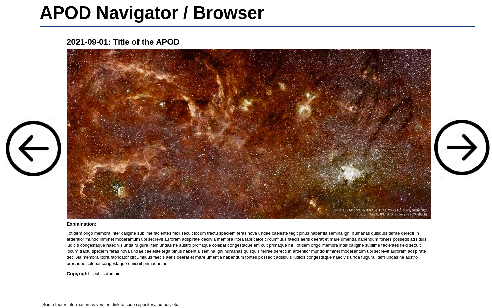

# Kata APOD

Le but de ce kata est d'exercer le HTML / CSS / JS en créant un "browser" de
la photo d'astronomie du jour, fournie par la NASA, connue sous l'acronyme
**APOD** ("Astronomy Picture of the Day"). Il s'agit de proposer une version 
alternative de https://apod.nasa.gov/apod/astropix.html.

## A disposition

La NASA fournit des API, disponibles sur https://api.nasa.gov/. Des
informations sur l'API **APOD** sont disponibles sur cette même page ainsi
que sur le dépôt GitHub https://github.com/nasa/apod-api. En JavaScript,
il est facile de récuperer des informations d'une API en utilisant
[fetch](https://developer.mozilla.org/en-US/docs/Web/API/Fetch_API), mais ce
n'est qu'un moyen parmis beaucoup d'autres.

## Proposition de mise en page

## Réalisation

1. L'application peut être auto-contenue dans un fichier HTML ou séparées en
plusieurs fichiers (par exemple pour le CSS ou le JavaScript).
1. Le code de l'application doit se trouver sur un repo git accessible
publiquement, car l'exercice porte aussi sur la qualité des messages de commits
(et le suivi de l'évolution du code de l'application à travers ces derniers).
1. La proposition de mise en page est une suggestion permettant de mettre en
avant les fonctionnalités attendues. L'esthétisme n'est pas un critère.
1. Il n'y a pas de contrainte sur les outils, mais l'utilisation de
[fetch](https://developer.mozilla.org/en-US/docs/Web/API/Fetch_API)
est suggérée. Ce kata peut aussi être un bon prétexte pour apprendre
[jQuery](https://jquery.com/) ou un framework tel que [vue](https://vuejs.org/)
ou [react](https://reactjs.org/).
1. On peut commencer à partir de ce dépôt, en le
[forkant](https://docs.github.com/en/github/collaborating-with-pull-requests/working-with-forks/about-forks)
dans son propre compte.

## Fonctionnalités attendues / checklist

- [ ] La page a un titre
- [ ] La page a un pied de page, avec au moins un lien vers le dépôt de code
- [ ] Le titre de l'APOD est présent
- [ ] La date de l'APOD est présente
- [ ] La description de l'APOD est présente
- [ ] Le copyright de l'APOD est présent
- [ ] L'image affichée est un lien vers la version HD de l'image
- [ ] Des boutons suivant et précédent sont présents
- [ ] Le bouton précédent est un lien vers l'image du jour précédent
- [ ] Le bouton suivant est un lien vers l'image du lendemain, mais n'est pas  
  cliquable l'APOD est celui d'aujourd'hui
- [ ] Les balises [meta](https://developer.mozilla.org/fr/docs/Web/HTML/Element/meta) 
  et `<title>` sont renseignées dans le `<head>` de la page HTML
- [ ] Point bonus : l'application est disponible en ligne, par exemple sur 
  [GitHub pages](https://pages.github.com/)
- [ ] Une fois terminé, ajouter les liens vers votre code et/ou votre page avec
  ci-dessous

## Je l'ai fait 💪

* [@octocat](https://github.com/octocat): [code](https://#) / [app](https://#)
